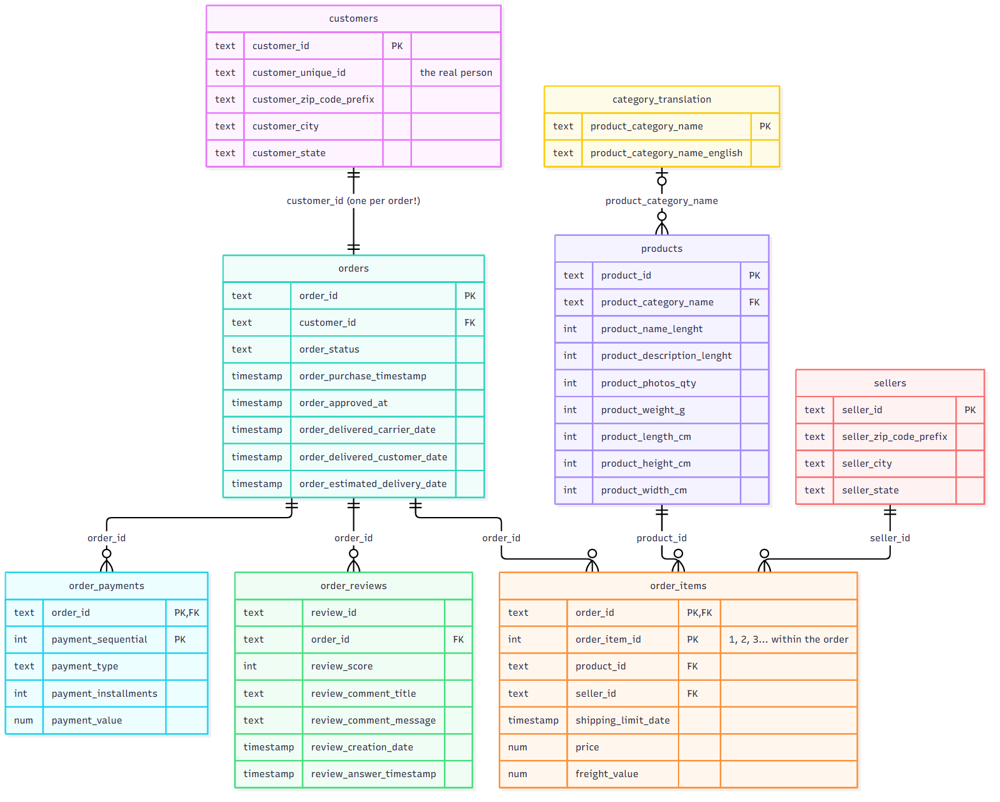
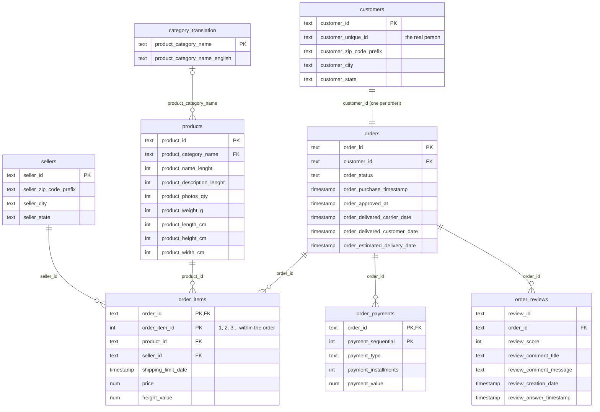

# Data Dictionary — Olist Raw Tables

These are the **raw (bronze)** tables: exactly what Olist published, before any
cleaning. They live in Snowflake at `DBT_LABS_DB.PUBLIC`, shared and read-only. In dbt
you reach them with `{{ source('olist', '<name>') }}`: the source name is short, and
`_sources.yml` maps it to the real table name.

The data covers about **100,000 orders** placed on Olist, a Brazilian online
marketplace, from **September 2016 to October 2018**. Most activity is between
January 2017 and August 2018; the months before and after are nearly empty. Olist
connects small shops (**sellers**) to shoppers (**customers**). One order can contain
several items, from different sellers.

> **Read "One row is..." first for every table.** Knowing what a single row means
> (the table's **grain**) is the most important thing about it. Most wrong answers
> come from joining two tables with different grains.

---

## How the tables connect (ERD)

Diagram source (Mermaid)

**Reading the ERD:** `||--o{` means "one to many". For example, one order has zero or
more items. **The center of everything is `orders`.** To connect a customer to a
product, go customers → orders → order_items → products.

`geolocation` is left off the diagram on purpose. It connects to customers and sellers
only loosely, by zip code prefix, and there are many rows per prefix. See below.

---

## Tables

| dbt source name | Snowflake table (`PUBLIC`) | Rows | One row is... |
|---|---|---:|---|
| `customers` | `OLIST_CUSTOMERS` | 99,441 | a customer **on one order** |
| `orders` | `OLIST_ORDERS` | 99,441 | an order |
| `order_items` | `OLIST_ORDER_ITEMS` | 112,650 | one item in an order |
| `order_payments` | `OLIST_ORDER_PAYMENTS` | 103,886 | one payment on an order |
| `order_reviews` | `OLIST_ORDER_REVIEWS` | 99,224 | a review attached to an order (see gotchas) |
| `products` | `OLIST_PRODUCTS` | 32,951 | a product |
| `sellers` | `OLIST_SELLERS` | 3,095 | a seller |
| `geolocation` | `OLIST_GEOLOCATION` | 1,000,163 | a lat/long point for a zip prefix |
| *(seed)* | `product_category_name_translation` (a CSV in `dbt/seeds/`) | 71 | a category's English name |

---

### `customers`
**One row is:** a customer *as they appeared on one order*.

| Column | Meaning | Example |
|---|---|---|
| `customer_id` | Id for this customer **on this order**. Unique. Joins to `orders.customer_id`. | `06b8999e2fba1a1fbc88172c00ba8bc7` |
| `customer_unique_id` | The actual **person**. Same value across all their orders. | `861eff4711a542e4b93843c6dd7febb0` |
| `customer_zip_code_prefix` | First 5 digits of their zip code. Text, because of leading zeros. | `01003` |
| `customer_city` | City, lowercase. | `sao paulo` |
| `customer_state` | Two-letter Brazilian state. 27 values. | `SP` |

> ⚠️ **The customer trap.** A new `customer_id` is created for **every order**, so
> counting `customer_id`s makes every shopper look like a one-time buyer. Count
> `customer_unique_id` for people: 96,096 people, of whom 2,997 ordered more than once.

---

### `orders`
**One row is:** one order.

| Column | Meaning | Example |
|---|---|---|
| `order_id` | Unique order id. | `e481f51cbdc54678b7cc49136f2d6af7` |
| `customer_id` | Who placed it. Joins to `customers.customer_id`. | |
| `order_status` | Where the order is. 8 values: `delivered` (96,478), `shipped`, `canceled`, `unavailable`, `invoiced`, `processing`, `created`, `approved`. | `delivered` |
| `order_purchase_timestamp` | When the customer bought. Never null. | `2017-10-02 10:56:33` |
| `order_approved_at` | When payment was approved. Null for 160 orders. | |
| `order_delivered_carrier_date` | When the seller handed it to the shipping company. | |
| `order_delivered_customer_date` | When the customer received it. Null if not delivered. | |
| `order_estimated_delivery_date` | Delivery date promised at purchase. Always midnight. | `2017-10-18 00:00:00` |

> ⚠️ 775 orders have **no items**, almost all `canceled` or `unavailable`. 8 orders say
> `delivered` but have no delivery date. About 6,500 delivered orders arrived **after**
> the estimated date: that's the "late delivery" metric.

---

### `order_items`
**One row is:** one item in an order. An order with 3 items has 3 rows.

| Column | Meaning | Example |
|---|---|---|
| `order_id` | Which order. | |
| `order_item_id` | The item's **position** in the order: 1, 2, 3... (up to 21). **Not** a unique id! `order_id` + `order_item_id` together are unique. | `1` |
| `product_id` | What was bought. | |
| `seller_id` | Who sold it. Items in one order can have different sellers (1,278 orders do). | |
| `shipping_limit_date` | Deadline for the seller to hand it to the carrier. | |
| `price` | Item price in Brazilian reais (R$). | `58.90` |
| `freight_value` | Shipping cost for this item. | `13.29` |

> 💡 Buying 2 of the same product creates **2 rows**; there is no quantity column.
> **Revenue** in this project means `sum(price)`.

---

### `order_payments`
**One row is:** one payment toward an order. Most orders have 1 payment; some split
across a card and vouchers.

| Column | Meaning | Example |
|---|---|---|
| `order_id` | Which order. | |
| `payment_sequential` | 1 for the first payment, 2 for the second... | `1` |
| `payment_type` | `credit_card`, `boleto` (a Brazilian bank slip), `voucher`, `debit_card`, `not_defined` (3 rows). | `credit_card` |
| `payment_installments` | Number of monthly installments the customer chose. | `3` |
| `payment_value` | Amount of this payment in R$. | `99.33` |

> ⚠️ For about 300 orders, total payments ≠ items + freight (interest on installments,
> vouchers). Use `order_items` for revenue and `order_payments` for *how people paid*.
> One delivered order has no payment at all.

---

### `order_reviews`
**One row is:** a review linked to an order. It's messier than it sounds.

| Column | Meaning | Example |
|---|---|---|
| `review_id` | Id of the survey. **Not unique**: 789 surveys cover more than one order. | |
| `order_id` | Which order. **Not unique** either: 547 orders have more than one review. | |
| `review_score` | 1 (worst) to 5 (best). | `5` |
| `review_comment_title` | Optional title, in Portuguese. Mostly null. | |
| `review_comment_message` | Optional comment, in Portuguese. Null for about 58% of reviews. | `Recebi bem antes do prazo estipulado.` |
| `review_creation_date` | When the survey was sent. | |
| `review_answer_timestamp` | When the customer answered. | |

> ⚠️ **Only `review_id` + `order_id` together are unique.** In staging we choose
> **one review per order** (the latest answer), because the question is always "how
> did the customer rate this order?"

---

### `products`
**One row is:** one product.

| Column | Meaning | Example |
|---|---|---|
| `product_id` | Unique product id. | |
| `product_category_name` | Category, **in Portuguese**. Null for 610 products. | `perfumaria` |
| `product_name_lenght` | Number of characters in the product's name. *(Yes, "lenght": the typo is in the source.)* | `40` |
| `product_description_lenght` | Number of characters in the description. Same typo. | `287` |
| `product_photos_qty` | Number of photos on the listing. | `1` |
| `product_weight_g` | Weight in grams. | `225` |
| `product_length_cm` / `_height_cm` / `_width_cm` | Package dimensions in cm. | `16` |

> 💡 The actual product names aren't included, only their length.

---

### `sellers`
**One row is:** one seller (a shop that sells on Olist).

| Column | Meaning | Example |
|---|---|---|
| `seller_id` | Unique seller id. | |
| `seller_zip_code_prefix` | First 5 digits of their zip code. | `13023` |
| `seller_city` | City. **Dirty:** some say `city/state` (`auriflama/sp`), one is a zip code, one is an email address. | `campinas` |
| `seller_state` | Two-letter state. 23 values. | `SP` |

---

### `geolocation` *(not used by the models)*
**One row is:** one latitude/longitude point for a zip code prefix. There are **many rows
per prefix** (1M rows, 19,015 prefixes), so it isn't a clean lookup table. Joining it
directly will multiply your rows. Available for extra-credit map work.

| Column | Meaning |
|---|---|
| `geolocation_zip_code_prefix` | First 5 digits of a zip code |
| `geolocation_lat` / `geolocation_lng` | Latitude / longitude |
| `geolocation_city` / `geolocation_state` | City and state (city spelling is inconsistent) |

---

### `product_category_name_translation` *(seed)*
**One row is:** one product category with its English name. This one is a **dbt seed**:
a small CSV in `dbt/seeds/` that dbt loads itself, so you reach it with
`{{ ref('product_category_name_translation') }}`, not `source()`.

| Column | Meaning | Example |
|---|---|---|
| `product_category_name` | Portuguese name. Joins to `products.product_category_name`. | `beleza_saude` |
| `product_category_name_english` | English name. | `health_beauty` |

> ⚠️ Covers **71 of the 73** categories. `pc_gamer` and
> `portateis_cozinha_e_preparadores_de_alimentos` have no translation.

---

For the cleaned tables we build from these (staging, the star schema, and marts), see
[star_schema.md](star_schema.md).
