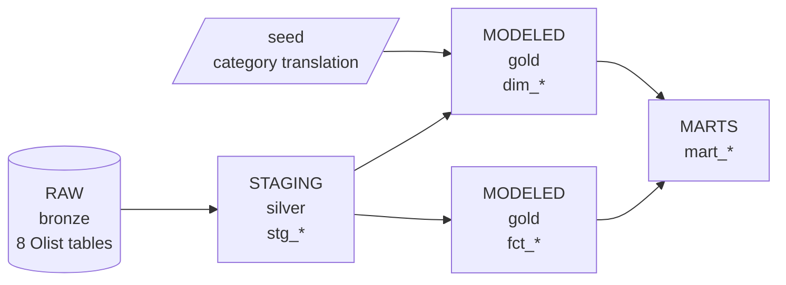
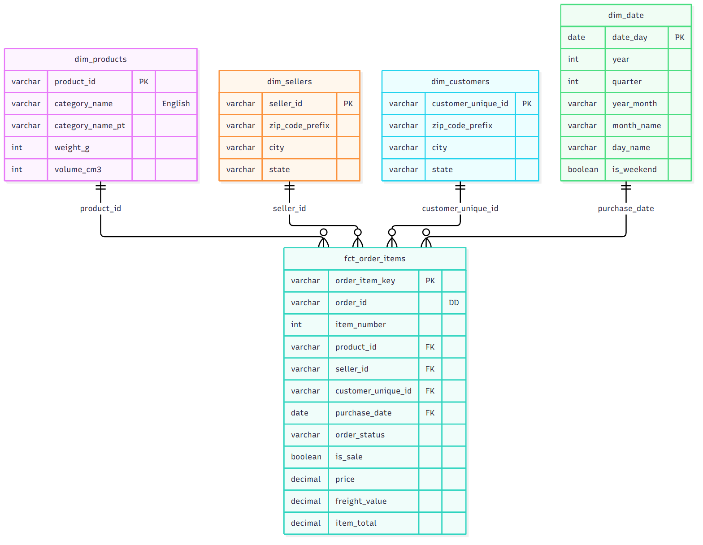
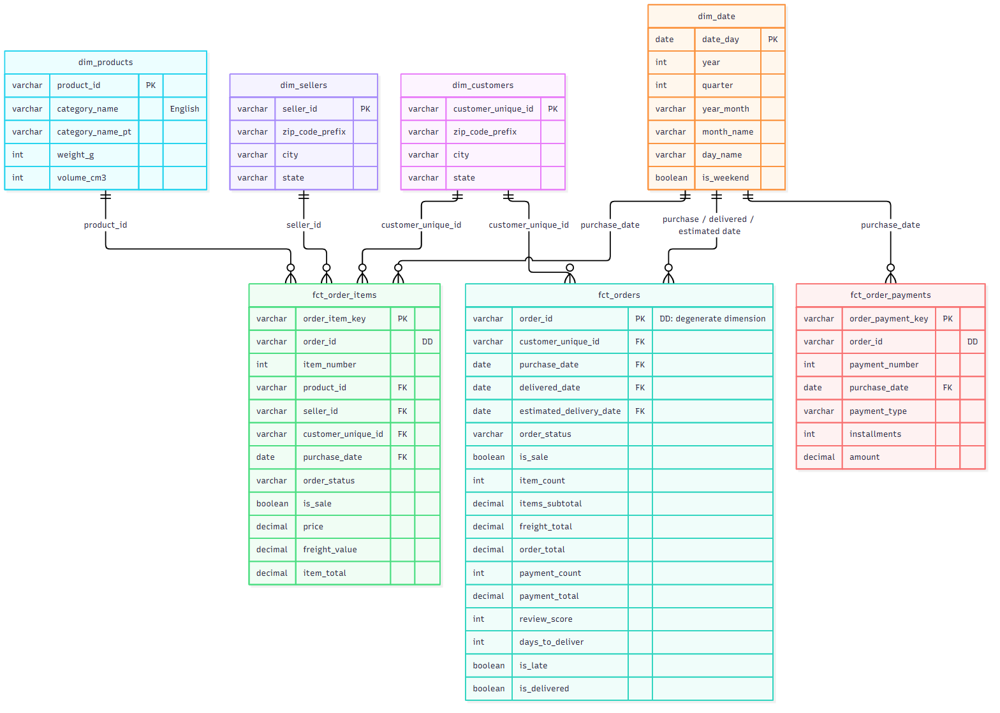
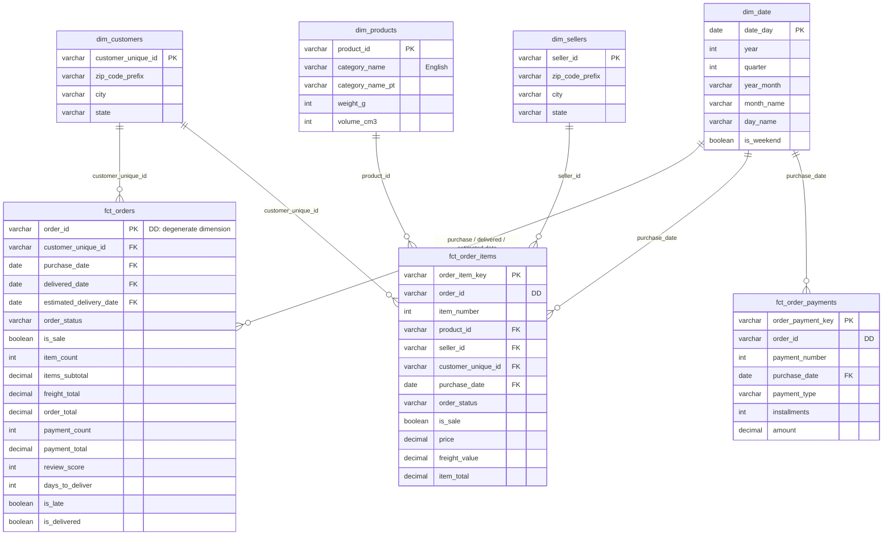

# The Star Schema — Modeled Tables

This is what we build **from** the raw tables in
[data_dictionary.md](data_dictionary.md): a **star schema**, with facts in the middle
and dimensions around them.

- A **fact** records **events**: an order, an item sold, a payment. Facts are mostly
  numbers you add up (`price`, `amount`) plus keys pointing at dimensions.
- A **dimension** describes **things**: who, what, where, when. Dimensions are the
  words you filter and group by (`category_name`, `state`, `month_name`).

Every question becomes the same shape: *start at a fact, join the dimensions you need,
group by, sum.*

---

## The layers



| Layer | dbt folder | In Snowflake | What happens there |
|---|---|---|---|
| Raw | *(not dbt)* | `PUBLIC.OLIST_*` | Data exactly as it arrived. Shared and read-only. |
| Staging | `models/staging/` | `STAGING.<YOU>__STG_*` | One model per raw table: rename, cast, clean, dedup. |
| Modeled | `models/modeled/` | `MODELED.<YOU>__DIM_*`, `<YOU>__FCT_*` | The star schema: dimensions + facts. |
| Marts | `models/marts/` | `MODELED.<YOU>__MART_*` | One table per business question. There's no separate marts schema. |

`<YOU>` is the `schema:` in your `profiles.yml`, e.g. `SMITH_JOHN__DIM_SELLERS`.

---

## Step 1: one fact, four dimensions

We start with **one fact table**, `fct_order_items`, and the four dimensions it points
at. This is already a complete star: every question about *what sold, who sold it, who
bought it, and when* can be answered from it.



---

## Step 2: the full star (ERD)

Then we add `fct_orders` (one row per order) and `fct_order_payments` (one row per
payment). Same dimensions, more facts. `dim_date` now plays three roles in `fct_orders`.

Notice what's **not** there: **no line connects one fact to another.** All three facts
carry `order_id`, marked **DD**, but it's a label they share, not a join path. See
[Facts don't join facts](#facts-dont-join-facts) below.



<details>
<summary>Diagram source (Mermaid)</summary>



</details>

---

## Dimensions

| Table | Rows | One row is... | Notes |
|---|---:|---|---|
| `dim_customers` | 96,096 | a **person** (`customer_unique_id`) | Not per `customer_id`! Location comes from their most recent order. |
| `dim_sellers` | 3,095 | a seller | City cleaned in staging. |
| `dim_products` | 32,951 | a product | `category_name` is English, or the Portuguese name if there's no translation, or `unknown` if there's no category. |
| `dim_date` | 1,096 | a calendar day, 2016 to 2018 | Generated, not loaded. Use it for month, weekday and weekend grouping. |

## Facts

| Table | Rows | One row is... | Use it for |
|---|---:|---|---|
| `fct_orders` | 99,441 | an order | Order counts, delivery times, late rate, review scores |
| `fct_order_items` | 112,650 | an item in an order | Revenue by product, category or seller |
| `fct_order_payments` | 103,886 | a payment | How people pay: type, installments |

### Things to know about `fct_orders`
- **Three dates, one `dim_date`.** `purchase_date`, `delivered_date` and
  `estimated_delivery_date` each join to `dim_date.date_day`. This is called a
  **role-playing dimension**: one dimension, used in three roles.
- **`is_late`** = delivered after the estimated date. Null if not delivered yet.
- **`order_total`** = items + freight. **`payment_total`** = what was actually paid.
  They differ for about 300 orders (installment interest, vouchers).
- Orders with no items (mostly canceled) have `item_count = 0`, not null.
- **`is_sale`** = the order counts as a sale (not canceled or unavailable). The rule is
  defined **once**, in `stg_orders`, and every mart filters on this flag instead of
  re-typing the status list. It's in `fct_order_items` too.

---

## Marts

| Table | Rows | Answers |
|---|---:|---|
| `mart_monthly_category_sales` | 1,282 | Which categories earn the most each month? One row per (month, category). |
| `mart_seller_performance` | 3,053 | Which sellers sell the most, deliver on time, and get good reviews? One row per seller that has sold something. |

Both marts **exclude canceled and unavailable orders**.

---

## Facts don't join facts

All three facts carry `order_id`. It's a **degenerate dimension (DD)**: an identifier
that lives in the fact itself, with no dimension table behind it. There's no `dim_order`,
because everything you'd put in one (status, dates, customer) is already in the facts.

Sharing a DD is fine. **Joining one fact straight to another on it is not**, because the
two facts have different grains:

```sql
-- ❌ WRONG: fct_orders is per order, fct_order_items is per item.
--    A 3-item order's review_score shows up 3 times, so the average is weighted by items.
select i.seller_id, avg(o.review_score)
from fct_order_items i
join fct_orders o on i.order_id = o.order_id
group by i.seller_id
```

The fix is a **drill-across**: bring each fact to the **same grain** first, then join.

```sql
-- ✅ RIGHT: roll items up to one row per (seller, order); now both sides are per order.
with seller_orders as (
    select distinct seller_id, order_id
    from fct_order_items
)
select so.seller_id, avg(o.review_score)
from seller_orders so
join fct_orders o on so.order_id = o.order_id
group by so.seller_id
```

`mart_seller_performance` is built exactly this way.

---

## Grain: the one mistake to avoid

Joining a "many" table to another "many" table **multiplies rows** (a **fan-out**):

> Order #1 has **3 items** and **2 payments**. Join items to payments on `order_id`
> and you get **3 × 2 = 6 rows**, so `sum(price)` counts every item twice.

The fix, used throughout this project: **roll each table up to the grain you want
first, then join.** See `fct_orders` (items and payments rolled up to one row per
order) and `mart_seller_performance` (items rolled up to one row per seller per
order) for examples.
